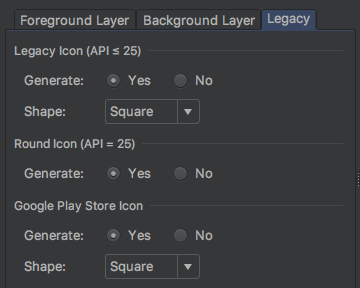
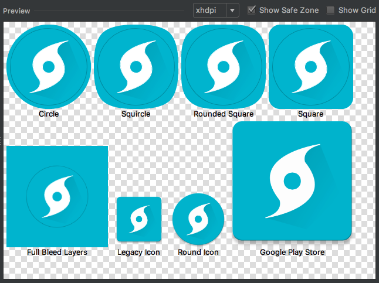

## Launcher Icon

Launcher icon was created by manually writing the `pathData` (predominantly using the [arc command]).

After creating the [foreground asset], [Image Asset Studio] was used to generate the [adaptive icon]
and legacy launcher icon assets.

### Image Asset Studio Settings

| Setting   | Value                                |
|-----------|--------------------------------------|
| Icon Type | Launcher Icons (Adaptive and Legacy) |
| Name      | `ic_launcher`                        |

#### Foreground Layer

| Setting    | Value                    |
|------------|:------------------------:|
| Layer Name | `ic_launcher_foreground` |
| Asset Type | Image                    |
| Trim       | No                       |
| Resize     | 54%                      |

#### Background Layer

| Setting    | Value                                                                   |
|------------|:-----------------------------------------------------------------------:|
| Asset Type | Color                                                                   |
| Color      |  `#00bcd4` |

#### Legacy

### Preview

[arc command]: https://www.w3.org/TR/SVG/paths.html#PathDataEllipticalArcCommands
[Image Asset Studio]: https://developer.android.com/studio/write/image-asset-studio
[foreground asset]: assets/launcher_foreground.xml?raw=true
[adaptive icon]: https://developer.android.com/guide/practices/ui_guidelines/icon_design_adaptive
